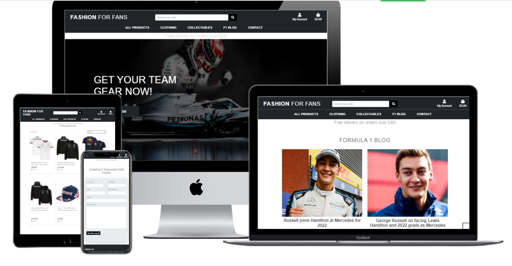
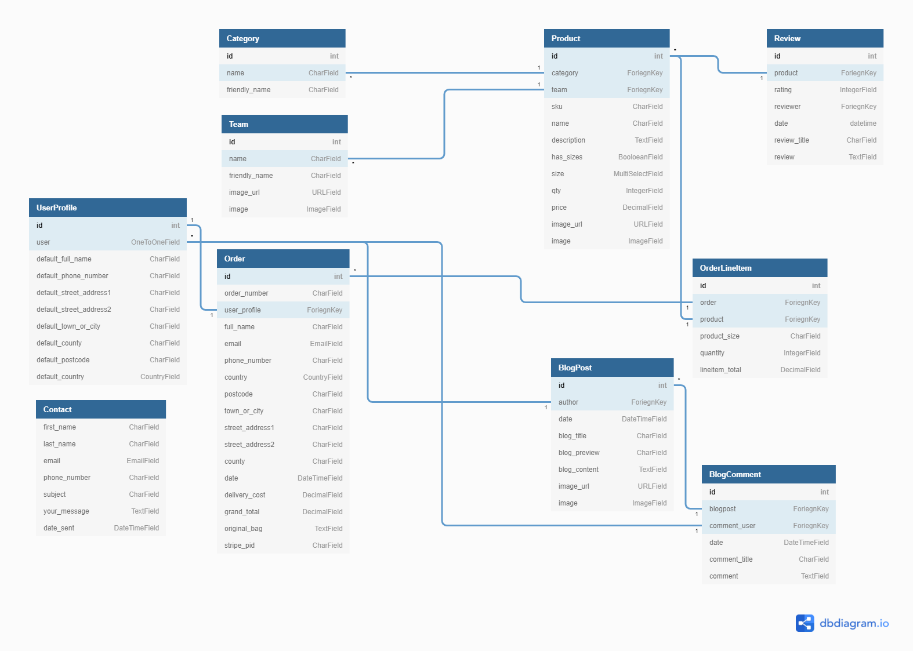
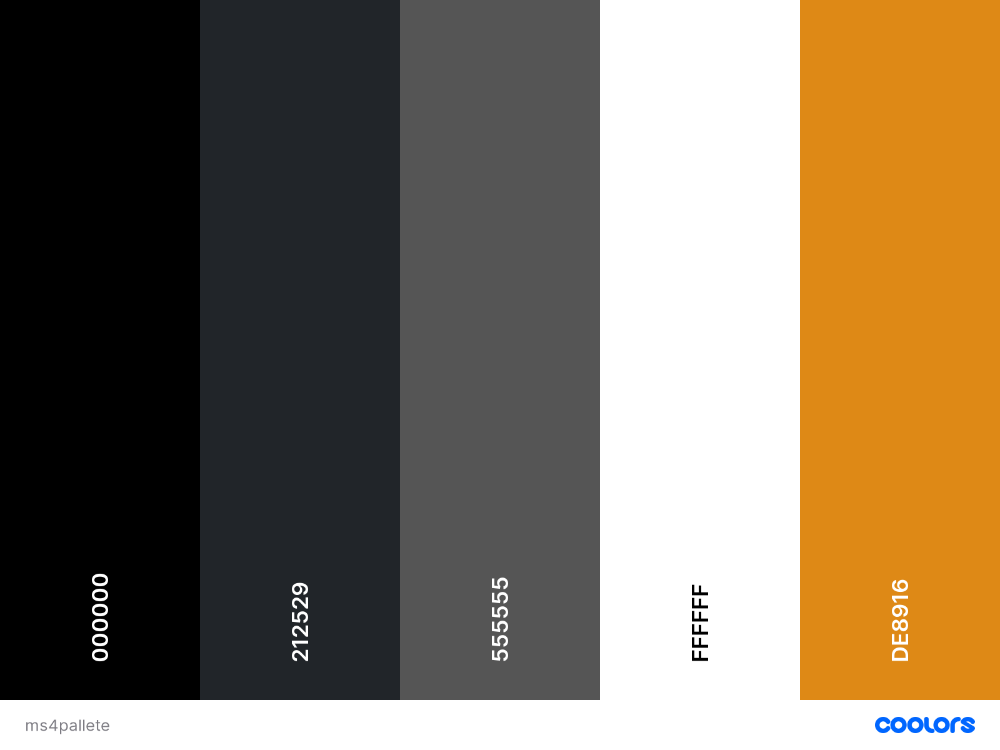
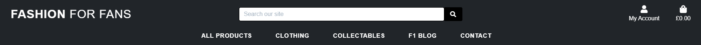
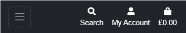
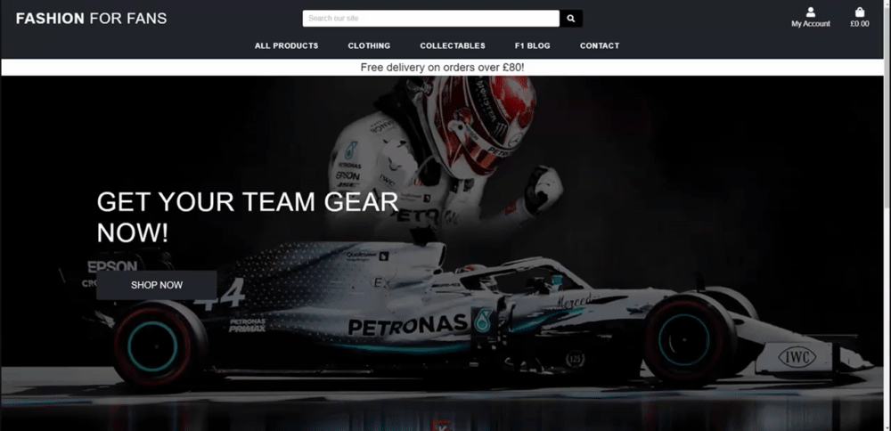
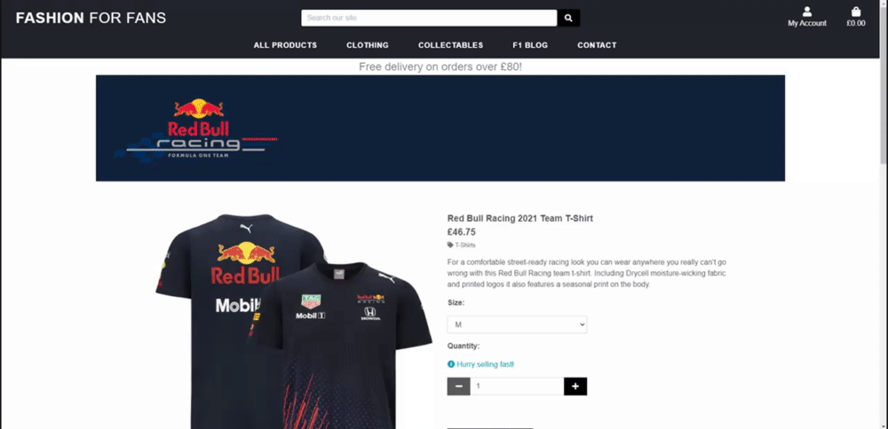
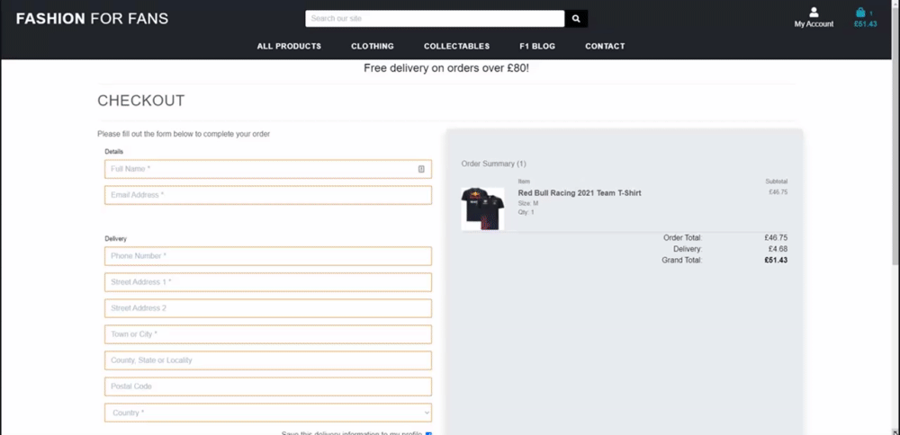
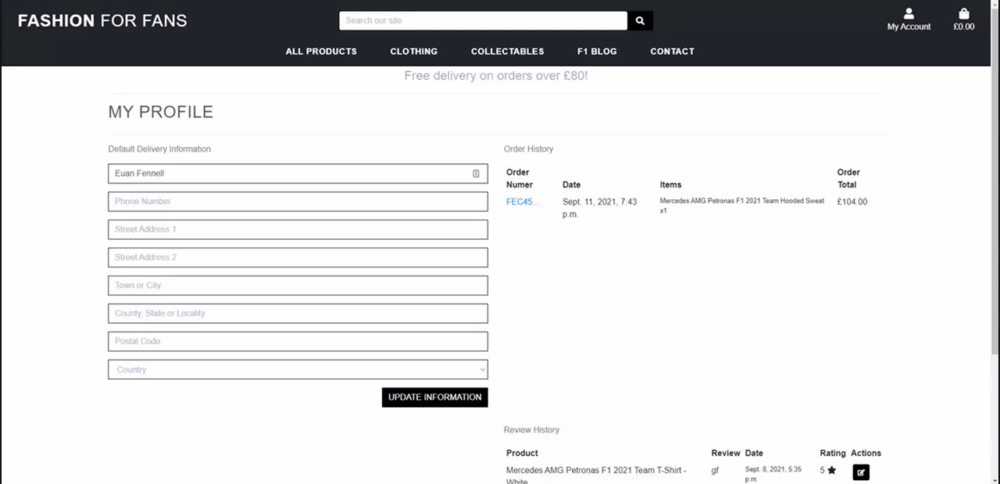
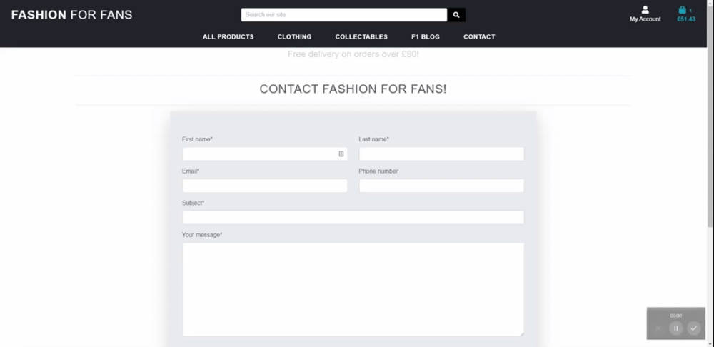

---
Fashion For Fans is an e-commerce web application developed as part of 
[*Code Institute, Diploma in Full Stack Software Development*](https://codeinstitute.net/full-stack-software-development-diploma/).

* The live site can be accessed [*here*](https://milestone4-fashion-for-fans.herokuapp.com/).



### User Stories ###

After viewing the Boutique Ado mini project, I decided to organize the user stories of this project in a spreadsheet rather then listing them here as they are extensive and a spreadsheet was also easier for me to follow through the development of this project.

Please [**click here**](https://docs.google.com/spreadsheets/d/1krBP_wim73PIZY5iCQW7BOCGfSIzZoCrX1ePJq6JsGg/edit?usp=sharing) to discover the User Stories.

### Strategy Goals: ###

#### Business Goals ####
* To sell merchandise for Formula 1 teams
* Offer a website that is easy to navigate and free of confusion.
* Offer a platform where fans can get the latest F1 news on the blog.
* To allow users to leave reviews on products to control product quality and popularity.
* To create a stock of products to be sold online and keep track of the sales as an admin.
* To be able to create/update/delete products and their infomation as an admin
* To enable users to create an account for future purchases.

#### User Goals ####

* To navigate the website easily and understand its purpose.
* To find products and their information (price, size, category, availability) fast and easy through a website search or through the navigation bar.
* To be able to buy products online as a guest or a registered user.
* To receive a confirmation email with all relevant information.
* To be able to create/update/delete my personal information.
* To see a history of my previous purchases.
* To leave a review of a previously bought product and leave comments on the blog.
* To contact customer services through the website.

<a name="Scope"></a>
### Scope ### 

The users should be able to conduct the following actions on the website:

* Use the navigation bar effectively on all devices.
* Conduct a product search by category, text and price in the search bar and get relevant results.
* Check product information when clicked.
* Add/remove items from the shopping bag.
* Add more than one item in the shopping bag.
* Get an update of the bag status each time one of the actions mentioned above happens.
* Purchase products securely through a payment platform.
* Create/Update/Save/Delete their profile account with personal information.
* Read reviews/comments as guest users, post reviews/comments as registered users.

As an Admin:
* Add, edit, delete a product and its information.
* Delete reviews that do not meet website policies.
* Create/Update sales product and special prices.
* Control stock levels of every item in store.

### Wireframes ###

The wireframes for this project were created using [**Balsamiq**](https://balsamiq.com/).
[**Click Here**](docs/milestone-4.pdf) for the project wireframes.

### Database ###

* I have created a database schema using [dbdiagram](https://dbdiagram.io/home) to give a visual representation of the databases within the project and the relations
between them.
* The schema is shown below.


### Design ###

The store has been desgined using dark colours with contrasting white. The reason for this is because of displaying items
from multiple teams all using different vivid colours I didn't want to over saturate the eye. The only place to use a different colour
is the buttons which have an orange colour on hover.\
I have created a palette using [coolors](https://coolors.co/) which is displayed below.\
\

\

### Icons ###
* Icons used in this project have been taken from [**Font Awesome**](https://fontawesome.com/)


### Font ###
* I decided to use a minimal font for this project that allows users to easily read and follow the flow of the site. I decided the Monserrat font from
[**Google Fonts**](https://fonts.google.com/) would fit the project requirements.


### Defensive Design ###


1. All required form inputs display a warning message as a tooltip if the field is filled incorrectly.
2. If a non-registered user tries to leave a comment or a review, they will be automatically redirected to the sign-in page.
3. Add to bag button is disabled if the product is out of stock.
4. If a user tries to add a number of a single product greater than the stock, a warning message will be displayed and the add to bag action is cancelled.
5. Every time a form is submitted (search, product, review, comment), the user is informed of the action success/failure through a toast message.
6. Implementation of webhooks to create order status in the database and avoid any misstep from the user during checkout.
7. Custom error pages redirecting to homepage.
8. Default images for blog posts and products if the image selected is broken or if no image was selected.


<a name="technologies"></a>

## Technologies ##
---

### Languages and Frameworks ###
* [HTML](https://developer.mozilla.org/en-US/docs/Web/HTML)
* [CSS](https://developer.mozilla.org/en-US/docs/Web/CSS)
* [Javascript](https://www.javascript.com/)
* [Python](https://www.python.org/)
* [JQuery](https://jquery.com/)
* [Bootstrap](https://getbootstrap.com/)
* [Font-Awesome](https://fontawesome.com/icons?d=gallery)
* [GSAP](https://greensock.com/gsap/)
* [Django](https://github.com/django/django)
* [SQLite](https://www.sqlite.org/index.html)


### Tools  ###

* [Google fonts](https://fonts.google.com/)
* [Git](https://git-scm.com/)
* [Gitpod](https://gitpod.io/)
* [Heroku](https://heroku.com/)
* [AWS](https://aws.amazon.com/)
* [Balsamiq](https://balsamiq.com/)
* [dbdiagram](https://dbdiagram.io/home)
* [Favicon.io](https://favicon.io/)
* [W3C HTML Validator](https://validator.w3.org/)
* [W3C CSS Validator](https://jigsaw.w3.org/css-validator/)
* [JSHINT](https://jshint.com/)
* [PEP8](http://pep8online.com/)


## Features ##
---

### Existiting Features ###

**Responsiveness**

* This feature allows the user to consult the website from any of their devices.

* All templates of this project have been built with the responsive framework Bootstrap 4. I also used targeted media queries to make this project responsive on all screen sizes

**Navigation bars**





* This feature allows the user to navigate through the website easily.

* This project has two responsive navigation bars present on all pages:
1. Main navigation bar: 
* The search bar allows the user to search for products by name, word, category.
* My profile dropdown menu: Links to register or sign in forms when the user is logged out. When logged in as a registered user, the menu links to the profile app and the logout page. When logged in as an admin, the dropdown links to the the product and blog management pages as well as the profile app and the log out page.
* Shopping bag: Update shopping bag once an item is added to the bag and displays the total price. 

2. Product/Contact/Blog navigation bar:
* This navigation bar allows the user to check the shop collections by different category.
* The user can also navigate to the blog section and the contact page.

**Home App**



* The home app consists of a hero image with text and a call to action button.
* The hero image clearly shows the user the intentions of the site.
* The hero text and button is lightly animated
* The latest products section displays random products from the database.


**Product App**


* This feature allows the user to see all products and their details on the website. The user can also read product reviews as well as Add/Edit/Delete their product review if they are logged in. It also allows the admin to Add/Edit/Delete products in the database.

1. Products page:
* The user can browse by product categories that are on the website through the navigation bar. A keyword search can also be conducted in the navigation bar search box to browse items more specifically.
* The products displayed can be sorted out by alphabetical order and price thanks to the selector under the page title.

2. Product detail page:
* This page displays all the product details (name, category, image, description, price, sizes if any) as well as the review section. All users can visit the product details and read the reviews but need the be registered and logged in to leave a review and a rating.

3. Review section:
* When logged in the user can edit and delete their review and rating directly from the review section. The edit button redirects to an edit form while the delete button triggers a confirmation modal and deletes the review forever if "Delete" is clicked in the modal.
* To add a review and a rating, the user can click on the "Leave a review" button and will be redirected to the add review page and fill a simple form. Once the form is filled and the user clicked the "Submit" button, they will be redirected to the product page.

4. Suggested Product:
* This feature is located at the bottom of the product details page and is implemented to encourage the customer to look into more store products.
* It generates maximum 4 product cards of the same product category as the product details viewed by the user.

5. Product management:
* If the user is logged in as an admin, they will have the possibility to navigate to the Product management page (through the profile dropdown menu in the main navigation bar) and have the possibility to add a product to the database by filling the add product form. Images can be selected directly from the user's computer and not only as url linked images.
* Only the admins can edit and/or delete any product by navigating on a product detail page and click on the edit/delete links.The edit link redirects to a edit form while the delete link triggers a confirmation modal and permanently deletes the product from the database if "Delete" is clicked in the modal.


**Shopping bag App**



* This feature allows the user to add/adjust/delete different products to the shopping bag and view the total price and details in the bag.
* When a product is added, a preview of the shopping bag is displayed in a toast message and the total price/shipping price is updated.

**Checkout App**



* This feature allows the user to safely purchase their selection of items they have added to their shopping bag thanks to [**Stripe**](https://stripe.com/gb).
* The user doesn't need to be logged in to buy products. If the user is logged in and they have stored their shipping info in their profile the form will be auto-filled. 
* If no details where given or a detail is changed in the checkout form when logged in, the user has the ability to check the Remember my details checkbox and all details will be updated in their profile.
* The credit card details section is linked to the payment platform [**Stripe**](https://stripe.com/gb) to ensure a secure payment procedure. 
* Once the complete order button is clicked it triggers custom loading animated screen that will remain while Stripe checks and processes the credit card details.
* If the payment does not go through, the user is redirected back to the checkout form and informed of the failed procedure.
* If the payment succeeds, the user will be redirected to the checkout success page to confirm payment was successful and they will be sent a confirmation email with the order details and the order number.

**Profile App**




* This feature allows the user to create a custom profile on the website and be given registered user privileges (comments, reviews, checkout details)
1. Registration
* The user can register to the website through the Register form page. Every account requests an email address, a username and a password.
* The email and password need to be confirmed twice to avoid typos.
* A verification email is sent to the user's email to avoid errors. That email contains a security link that opens a "confirmed email" page on the website. The user is added to the database and is allowed to complete their profile on their new profile page.

2. Signing in.
* If the user is already registered, they can sign in through the login page. The user needs their email adress or username as well as their password to sign in. The user can also retrieve their password if forgotten.
* Once the login form is approved, the user is redirected to their profile page containing their personal information.

3. Log out
* Once the the user is logged in, they can easily log out by accessing the logout page through the main navigation bar and confirm on that page their intention to log out. The user is then redirected to the index page.

4. Profile Page:
* The profile page is personal and contains:
    - An editable personal information form including the shipping details that will be remember at checkout if logged in.
    - An order history with order number, date and order details. The order number links to the order confirmation page.
    - A review history with date, review and rating. the user can delete or edit their reviews from there.


**Blog App**


* This feature allows the user to catch up on recent Formula 1 news, website news e.g sales and special offers.

1. The F1 Blog:
* This can be accessed directly through the main navigation menu.
* The page will display all blog items via an image and a headline and blog author.
* Each blog item has a read more button that will open the corresponding blog

2. Blog Detail:
* This page displays the full blog post selected by the user. As well as the comments for that particular blog story.
* All users can read the blog post and its corresponding comments but only logged in users may comment or edit their own comments.

3. Comments:
* Users who are logged in can edit and delete their own comments directly from the comments section. the edit button will direct the user to an edit comment form that is pre-populated
with their current comment.
* For users to add a comment they can click the Leave a Comment button and they will be directed to a form to leave a comment. When the form is submitted they are then redirected back to the blog page.

4. Blog Management:
* Admin users are able to add blog posts via the My Account dropdown menu. This directs them to a form where they can create the blog post and upload the blog image.
* Only admins are able to edit and delete blog posts or blog comments made by any user if they violate TOS.

**Contact App**



* This feature allows the user to contact the website's admin and send queries.

* The Contact page allows the user to send a written query to the admin. The query is stored in the database and two email alerts are sent: one to the user to confirm that the message was received and one to the admin to notify admin that a user has sent a query. The alert sent to the admin contains all information given by the user in the contact form.
* The user does not need to be a registered user to send a query.

## Testing ##
---

All apps and features have been manually tested,  please [click here]() to access the testing document


## Deployment ##
---
<a name="requirements"></a>

### Requirements ###

* an IDE , I used GitPod.
* PIP, for Python packages.
* Python3
* Git for version control.
* Stripe (account, test keys and webhooks) as a secure payment platform.
* AWS cloud storage and an S3 bucket for online backup of static files.
* Email account, I used Gmail.

<a name="locald"></a>

### Local Deployment ###

<a name="herokud"></a>

**1. Clone from Github**

* You can run this project locally on your IDE of choice by saving a copy of the Github repository at https://github.com/horizons83/Milestone4-Fashion-For-Fans.git by clicking the "Download Code" button or by running this command in your IDE command line:
```
$ git clone https://github.com/horizons83/Milestone4-Fashion-For-Fans.git
```
To remove any link to github, you can use the command git remote rm origin into their terminal.

**2. Install Python required modules**

* run the command below to install all the module required to run this project:
```
pip3 install -r requirements.txt
```

**3. Store environment variables**

* If you decide to use Gitpod for the development of this project and you can store your environement variables directly in Gitpod by clicking on "Settings" on the Worspaces page then inserted the following variables in  the "Environement Variables" section :

```
'DEVELOPMENT', 'True'
'SECRET_KEY', '<your value>'
'STRIPE_PUBLIC_KEY', '<your value>'
'STRIPE_SECRET_KEY', '<your value>'
'STRIPE_WH_SECRET', '<your value>'
```

* If using another IDE or Gitpod, create env.py file in the root directory of the project and include the following:

```
import os

os.environ["STRIPE_PUBLIC_KEY"] = "YOUR_STRIPE_PUBLIC_KEY"
os.environ["STRIPE_SECRET_KEY"] = "YOUR_STRIPE_SECRET_KEY"
os.environ["STRIPE_WH_SECRET"] = "YOUR_STRIPE_WH_SECRET"
os.environ["SECRET_KEY"] = "YOUR_SECRET_KEY_HERE"
os.environ["DEVELOPMENT"] = "True"
```

* Follow these instructions to fill in the values of each keys:
    - the SECRET_KEY : use a Django Secret Key Generator such as [miniwebtool](https://miniwebtool.com/django-secret-key-generator/)
    - the STRIPE_PUBLIC_KEY and STRIPE_SECRET_KEY can be found on the Stripe Dashboard in the Developer's API section.
    - the STRIPE_WH_SECRET: Can be found in the Developer'sAPI section after creating a webhook.

**4. Migrate database models**

* Run the commands below to migrate the models and set up an SQLite database:

````
python3 manage.py makemigrations
python3 manage.py migrate
````

**5. Load categories and products**

* Run the command below in that exact order to load category then product fixtures:

````
python3 manage.py loaddata categories
python3 manage.py loaddata products
````

**6. Create SuperUser**

* A superUser is needed to access the admin panel in Django. Run the command below and follow the instructions after (email needed):

````
python3 manage.py createsuperuser
````

**7. Run the app**

* Enter the command below to start running the project locally :

````
python3 manage.py runserver
````


### Heroku Deployment ###

**1. Signup and login to Heroku**

* Start by going to https://heroku.com/ and create an account or sign in your already existing account.
* Create an app with a unique name and choose your location.
* Navigate to the Resource tab and create a free Postgres database. 

**2. Prepare the database**

* The DATABASE_URL variable was automatically created in the Settings< Config Vars section. Copy its value and temporarily add it to your environment variables in your IDE or your env.py.

* In your Heroku App, navigate to Settings and set the following variables in the Config Vars section:

`````
'AWS_ACCESS_KEY_ID', '<your value>'
'AWS_SECRET_ACCESS_KEY', '<your value>'
'DATABASE_URL', '<your value>'
'SECRET_KEY', '<your value>'
'STRIPE_PUBLIC_KEY', '<your value>'
'STRIPE_SECRET_KEY', '<your value>'
'STRIPE_WH_SECRET', '<your value>'
'USE_AWS', 'True'
`````

* You can now make the migrations to start using Postgres:
``````
python3 manage.py makemigrations
python3 manage.py migrate
``````
* And load the category the product fixtures:
``````
python3 manage.py loaddata categories
python3 manage.py loaddata products
``````

**3. Create a Superuser for mew Postgres database**

* Run the following command to create a superuser to navigate to Django's admin panel:

``````
python3 manage.py createsuperuser
``````

**4. Create Procfile**

* Create a Procfile and add " web: python app.py "then save.
* Push all changed files to Github by running the following commands:
```````
git add .
git commit -m "..."
git push
```````

**5. Remove DATABASE_URL variable**

* Delete the temporary DATABASE_URL from your environement variables or env.py.

**6. Install Heroku CLI and login**

* In case your environment doesn't have it already, run this command to install the Heroku CLI in your terminal:

``````
$ heroku login
``````
* To login from the CLI run the following command in your terminal:
```````
heroku login -i
```````

**7. Settings**

*Add the hostname of your Heroku App to "ALLOWED HOSTS" in settings.py. the Hostname can be found in the heroku settings < App Name . 

**8. Connect repository to Heroku**

* 1. You can connect your Github repository directly in the Heroku app by selecting your repository in the Deploy tab < Deployment method. I also selected the Automatic Deployment option for convenience. Click on Deploy.

* 2. Copy the Heroku gir url in the Heroku app Setting tab and run the command below to connect your repository:

```````
$ git remote add heroku <your heroku git url>
```````

**9. Add static files to AWS S3**
* In your S3 Bucket, create a 'Media' folder and add all your media files. 
* Still in the bucket, create a 'Static' folder. Django will collect all static files and upload them to S3 as soon as the app is deployed to Heroku

**10. Push to Heroku**

* If you have decided to connect your Github repository to heroku and selected the automatic deployment option, commit and push will be pushed to Heroku.

* In other scenarios , use the following command:

```````
$ git push -u heroku master
```````

The app can now be open at https://< your-app-name >.herokuapp.com/

## Credits ##
---
**Code Tutorials**
* This project was referenced to the BOUTIQUE ADO project from CI

**Hero Image**
* The hero image was taken from [Wallpaperforu](https://wallpaperforu.com/wallpaper-formula-1-mercedes-benz-mercedes-f1-lewis/)

**Products**
* All products and product images were taken from the [Official F1 Store](https://f1store.formula1.com/en/)
* Team banners were created by myself using [Adobe Illustrator](https://adobe.ly/3lxv2iI)

**Blog Stories**
* Blog stories and images were taken from [Sky Sports F1 News](https://www.skysports.com/f1)

**Other Credits**
* Audrey Lloancy for inspiration for contact and review/comment options.
* My mentor Gerry Mcbride for his continued guidence.
* CI for the fantastic opportunity.