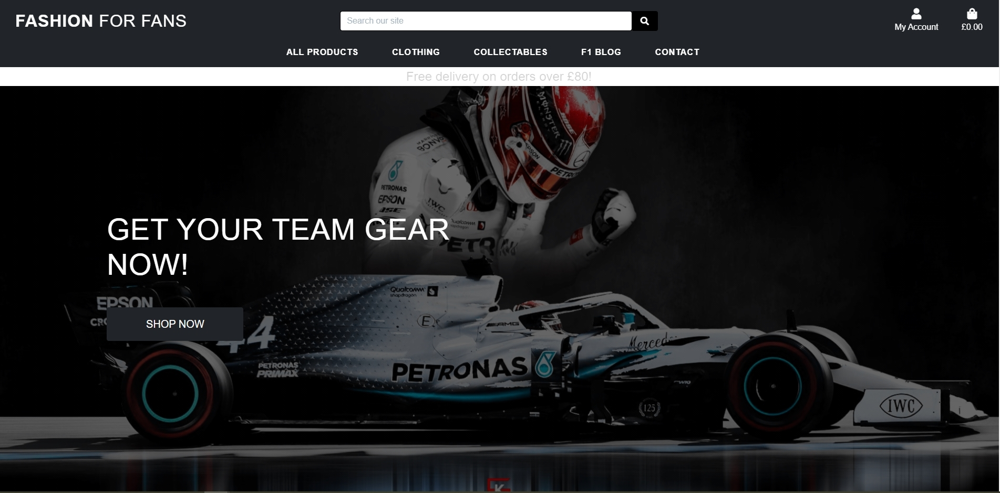

# Fashion For Fans #
---


### User Stories ###

After viewing the Boutique Ado mini project, I decided to organize the user stories of this project in a spreadsheet rather then listing them here as they are extensive and a spreadsheet was also easier for me to follow through the development of this project.

Please [**click here**](https://docs.google.com/spreadsheets/d/1krBP_wim73PIZY5iCQW7BOCGfSIzZoCrX1ePJq6JsGg/edit?usp=sharing) to discover the User Stories.

### Strategy Goals: ###

#### Business Goals ####
* To sell merchandise for Formula 1 teams
* Offer a website that is easy to navigate and free of confusion.
* Offer a platform where fans can get the latest F1 news on the blog.
* To allow users to leave reviews on products to control product quality and popularity.
* To create a stock of products to be sold online and keep track of the sales as an admin.
* To be able to create/update/delete products and their infomation as an admin
* To enable users to create an account for future purchases.

#### User Goals ####

* To navigate the website easily and understand its purpose.
* To find products and their information (price, size, category, availability) fast and easy through a website search or through the navigation bar.
* To be able to buy products online as a guest or a registered user.
* To receive a confirmation email with all relevant information.
* To be able to create/update/delete my personal information.
* To see a history of my previous purchases.
* To leave a review of a previously bought product and leave comments on the blog.
* To contact customer services through the website.

<a name="Scope"></a>
### Scope ### 

The users should be able to conduct the following actions on the website:

* Use the navigation bar effectively on all devices.
* Conduct a product search by category, text and price in the search bar and get relevant results.
* Check product information when clicked.
* Add/remove items from the shopping bag.
* Add more than one item in the shopping bag.
* Get an update of the bag status each time one of the actions mentioned above happens.
* Purchase products securely through a payment platform.
* Create/Update/Save/Delete their profile account with personal information.
* Read reviews/comments as guest users, post reviews/comments as registered users.

As an Admin:
* Add, edit, delete a product and its information.
* Delete reviews that do not meet website policies.
* Create/Update sales product and special prices.
* Control stock levels of every item in store.

### Wireframes ###

The wireframes for this project were created using [**Balsamiq**](https://balsamiq.com/).

### Defensive Design ###


1. All required form inputs display a warning message as a tooltip if the field is filled incorrectly.
2. If a non-registered user tries to leave a comment or a review, they will be automatically redirected to the sign-in page.
3. Add to bag button is disabled if the product is out of stock.
4. If a user tries to add a number of a single product greater than the stock, a warning message will be displayed and the add to bag action is cancelled.
5. Every time a form is submitted (search, product, review, comment), the user is informed of the action success/failure through a toast message.
6. Implementation of webhooks to create order status in the database and avoid any misstep from the user during checkout.
7. Custom error pages redirecting to homepage.
8. Default images for blog posts and products if the image selected is broken or if no image was selected.


<a name="technologies"></a>

## Technologies ##
---

### Languages and Frameworks ###
* [HTML](https://developer.mozilla.org/en-US/docs/Web/HTML)
* [CSS](https://developer.mozilla.org/en-US/docs/Web/CSS)
* [Javascript](https://www.javascript.com/)
* [Python](https://www.python.org/)
* [JQuery](https://jquery.com/)
* [Bootstrap](https://getbootstrap.com/)
* [Font-Awesome](https://fontawesome.com/icons?d=gallery)
* [GSAP](https://greensock.com/gsap/)
* [Django](https://github.com/django/django)
* [SQLite](https://www.sqlite.org/index.html)


### Tools  ###

* [Google fonts](https://fonts.google.com/)
* [Git](https://git-scm.com/)
* [Gitpod](https://gitpod.io/)
* [Heroku](https://heroku.com/)
* [AWS](https://aws.amazon.com/)
* [Balsamiq](https://balsamiq.com/)
* [dbdiagram](https://dbdiagram.io/home)
* [Favicon.io](https://favicon.io/)
* [W3C HTML Validator](https://validator.w3.org/)
* [W3C CSS Validator](https://jigsaw.w3.org/css-validator/)
* [JSHINT](https://jshint.com/)
* [PEP8](http://pep8online.com/)


## Deployment ##
---
<a name="requirements"></a>

### Requirements ###

* an IDE , I used GitPod.
* PIP, for Python packages.
* Python3
* Git for version control.
* Stripe (account, test keys and webhooks) as a secure payment platform.
* AWS cloud storage and an S3 bucket for online backup of static files.
* Email account, I used Gmail.

<a name="locald"></a>

### Local Deployment ###

<a name="herokud"></a>

**1. Clone from Github**

* You can run this project locally on your IDE of choice by saving a copy of the Github repository at https://github.com/horizons83/Milestone4-Fashion-For-Fans.git by clicking the "Download Code" button or by running this command in your IDE command line:
```
$ git clone https://github.com/horizons83/Milestone4-Fashion-For-Fans.git
```
To remove any link to github, you can use the command git remote rm origin into their terminal.

**2. Install Python required modules**

* run the command below to install all the module required to run this project:
```
pip3 install -r requirements.txt
```

**3. Store environment variables**

* If you decide to use Gitpod for the development of this project and you can store your environement variables directly in Gitpod by clicking on "Settings" on the Worspaces page then inserted the following variables in  the "Environement Variables" section :

```
'DEVELOPMENT', 'True'
'SECRET_KEY', '<your value>'
'STRIPE_PUBLIC_KEY', '<your value>'
'STRIPE_SECRET_KEY', '<your value>'
'STRIPE_WH_SECRET', '<your value>'
```

* If using another IDE or Gitpod, create env.py file in the root directory of the project and include the following:

```
import os

os.environ["STRIPE_PUBLIC_KEY"] = "YOUR_STRIPE_PUBLIC_KEY"
os.environ["STRIPE_SECRET_KEY"] = "YOUR_STRIPE_SECRET_KEY"
os.environ["STRIPE_WH_SECRET"] = "YOUR_STRIPE_WH_SECRET"
os.environ["SECRET_KEY"] = "YOUR_SECRET_KEY_HERE"
os.environ["DEVELOPMENT"] = "True"
```

* Follow these instructions to fill in the values of each keys:
    - the SECRET_KEY : use a Django Secret Key Generator such as [miniwebtool](https://miniwebtool.com/django-secret-key-generator/)
    - the STRIPE_PUBLIC_KEY and STRIPE_SECRET_KEY can be found on the Stripe Dashboard in the Developer's API section.
    - the STRIPE_WH_SECRET: Can be found in the Developer'sAPI section after creating a webhook.

**4. Migrate database models**

* Run the commands below to migrate the models and set up an SQLite database:

````
python3 manage.py makemigrations
python3 manage.py migrate
````

**5. Load categories and products**

* Run the command below in that exact order to load category then product fixtures:

````
python3 manage.py loaddata categories
python3 manage.py loaddata products
````

**6. Create SuperUser**

* A superUser is needed to access the admin panel in Django. Run the command below and follow the instructions after (email needed):

````
python3 manage.py createsuperuser
````

**7. Run the app**

* Enter the command below to start running the project locally :

````
python3 manage.py runserver
````


### Heroku Deployment ###

**1. Signup and login to Heroku**

* Start by going to https://heroku.com/ and create an account or sign in your already existing account.
* Create an app with a unique name and choose your location.
* Navigate to the Resource tab and create a free Postgres database. 

**2. Prepare the database**

* The DATABASE_URL variable was automatically created in the Settings< Config Vars section. Copy its value and temporarily add it to your environment variables in your IDE or your env.py.

* In your Heroku App, navigate to Settings and set the following variables in the Config Vars section:

`````
'AWS_ACCESS_KEY_ID', '<your value>'
'AWS_SECRET_ACCESS_KEY', '<your value>'
'DATABASE_URL', '<your value>'
'SECRET_KEY', '<your value>'
'STRIPE_PUBLIC_KEY', '<your value>'
'STRIPE_SECRET_KEY', '<your value>'
'STRIPE_WH_SECRET', '<your value>'
'USE_AWS', 'True'
`````

* You can now make the migrations to start using Postgres:
``````
python3 manage.py makemigrations
python3 manage.py migrate
``````
* And load the category the product fixtures:
``````
python3 manage.py loaddata categories
python3 manage.py loaddata products
``````

**3. Create a Superuser for mew Postgres database**

* Run the following command to create a superuser to navigate to Django's admin panel:

``````
python3 manage.py createsuperuser
``````

**4. Create Procfile**

* Create a Procfile and add " web: python app.py "then save.
* Push all changed files to Github by running the following commands:
```````
git add .
git commit -m "..."
git push
```````

**5. Remove DATABASE_URL variable**

* Delete the temporary DATABASE_URL from your environement variables or env.py.

**6. Install Heroku CLI and login**

* In case your environment doesn't have it already, run this command to install the Heroku CLI in your terminal:

``````
$ heroku login
``````
* To login from the CLI run the following command in your terminal:
```````
heroku login -i
```````

**7. Settings**

*Add the hostname of your Heroku App to "ALLOWED HOSTS" in settings.py. the Hostname can be found in the heroku settings < App Name . 

**8. Connect repository to Heroku**

* 1. You can connect your Github repository directly in the Heroku app by selecting your repository in the Deploy tab < Deployment method. I also selected the Automatic Deployment option for convenience. Click on Deploy.

* 2. Copy the Heroku gir url in the Heroku app Setting tab and run the command below to connect your repository:

```````
$ git remote add heroku <your heroku git url>
```````

**9. Add static files to AWS S3**
* In your S3 Bucket, create a 'Media' folder and add all your media files. 
* Still in the bucket, create a 'Static' folder. Django will collect all static files and upload them to S3 as soon as the app is deployed to Heroku

**10. Push to Heroku**

* If you have decided to connect your Github repository to heroku and selected the automatic deployment option, commit and push will be pushed to Heroku.

* In other scenarios , use the following command:

```````
$ git push -u heroku master
```````

The app can now be open at https://< your-app-name >.herokuapp.com/