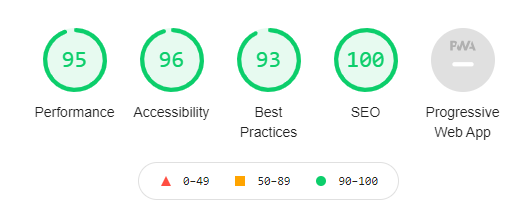
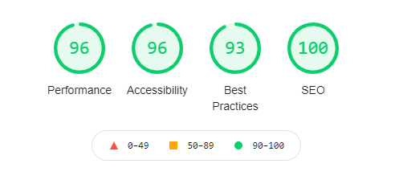
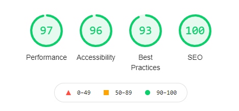
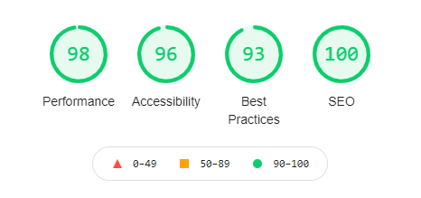
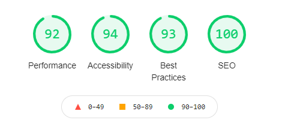
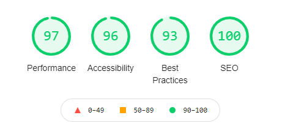
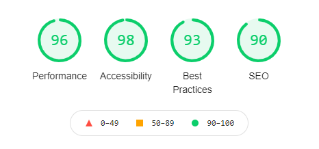
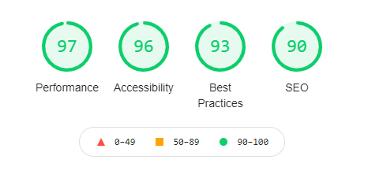
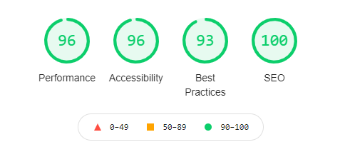
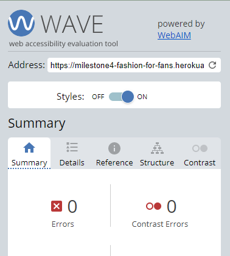

# Testing #
---

## Table of Contents ##
---

* 1. [Validation](#validation)
* 2. [Colour Contrast Checking](#colour)
* 3. [Manual testing](#manual-testing)
        * [Viewing and Navigation](#viewing-and-navigation)
        * [Registration and Accounts](#registration-and-accounts)
        * [Product sorting and searching](#sorting-and-searching)
        * [Purchase and Checkout](#purchasing-and-checkout)
        * [Admin and Store Management](#admin-and-store-management)
        * [Stripe](#stripe)
* 4. [Issues](#issues)

## Validation 
---
This project was test on several devices such as: Iphone 6S, Iphone 11, Iphone 12, Iphone 12 Pro Max, Ipad Pro, Ipad, Samsung Tab S6 Lite, Samsung Tab 6 Pro and Oppo Neo X2. It was tested on several web browser such as Google Chrome, Firefox and Safari.

I also asked my friends and family to report any bugs while testing it and used Google Chrome DevTools to do further testing.

**HTML**

I used the [**W3C Markup Validator Service**](https://validator.w3.org/) to validate all the HTML of my templates and it passed all tests.

**CSS**

I used the [**W3C CSS Validator Service**](https://jigsaw.w3.org/css-validator/) to validate my css files and it passed all tests.

**Javascript**

I used [**JSHint**]() to validate my .js files.
It only raised a few missing semicolons.

**Python**

I used the Gitpod built-in linter and [**PEP8**] to validate my Python files.

**Google Lighthouse**

I tested this app on Google Lighthouse and it passed all tests.

* **Home page**\

* **Products**\

* **Products Details**\

* **Shopping Bag**\

* **Checkout**\

* **Profile**\

* **Blog**\

* **Blog Story**\

* **Contact**\

## Colour Contrast Checking ## 
---

Contrast was important in this project because of the wide colours used by the Formula One teams, I used [**WebAIM**](https://wave.webaim.org/) to check the color contrasts and it passed all tests.\

## Manual Testing ## 
---

### Viewing and navigation

a. As a shopper I want to be able understand the purpose of the website and have preview of the items that are sold.

* Expected: site expected to display functional landing page with subtle text animation, featured products and footer with social links and store information.
* Testing: Navigated to the index page of the website and verified that text animation was functional, that the call to action button linked to the products page and that all external links opened in new tabs. I also checked that the featured products were randomly selected by refreshing the page several times.
* Result: The site acted as expected and displayed all sections of the landing page, the random featured products and the external links correctly.

b. As a shopper I want to be able to browse and view the product list.

* Expected: site expected to display functional product templates and navigation bars when the user is navigating the website.
* Testing: Navigated through the navigation bar and clicked on all navigation links to verify that corresponding product cards with correct informations are displayed. Navigated to 'All products ' to check that all the products added to the database were displayed and that the 'back to top' arrow button was functional by clicking on it while being at the bottom of the page.
* Result: The site acted as expected, displayed all the product cards accordingly as well as the button and code 200 in the terminal.

c. As a shopper I want to be able to check individual product details such as price, size, category and description.

* Expected: site expected to display correct product detail template when the user clicks on a specific product card.
* Testing: Clicked on a product page and I was directed to the product page details, verified that all product data was correctly displayed and that dropdowns and selectors were functional. Checked if the availability was displayed correctly depending on the amount of product available.
* Result: The site acted as expected, displayed all product data correctly, all dropdown/selectors are functional (size field is displayed only on products that contain sizes). Showed code 200 in the terminal.

d. As a shopper I want to be able to easily go through my bag content and total cost of my order.

* Expected: site expected to allow non-registered users to add items to their bag, display the right total/individual costs and shipping costs.
* Testing: Added a product to the bag and checked that it was correctly displayed in the bag toast with no bugs then clicked on the 'Secure Checkout' button to navigate to the bag page. Verified if all product data shows and that the shipping cost and product cost add up correctly.
* Result: The site acted as expected and displayed the correct information in the bag toast as well as the bag template. Showed Code 200 in the terminal.

e. As a shopper I want to be able to read product reviews.

* Expected: site expected to display reviews related to the product that the user is viewing.
* Testing: Navigated to the product detail template for different products and made sure that the reviews section was displaying related reviews / ratings.
* Result: Site acted as expected and displayed the affiliated reviews to the products. Shows code 200 in the terminal.

f. As a shopper I want to be able to read blog posts and comments.

* Expected: site expected to display all blog pages and related comments when the user navigates to the blog section.
Testing: Navigated to the blog detail template for different blog posts and checked that all details are displayed accordingly, made sure that the comment section was displaying related comments.
* Result: Site acted as expected and displayed blog posts correctly and the related comments as well. Shows code 200 in the terminal.

g. As a shopper I want to be able to get suggested products.

* Expected: site expected to display suggested products at the bottom of the product detail page depending on the category of the product being viewed.
Testing: Navigated a category of product and selected one. Scrolled down to the bottom of the page to verify if suggested product section was functional and was displaying product cards of the same category.
* Result: Site acted as expected and displayed suggested products of the same category.

### Registration and Accounts

a. As a site user I want to be able to register for an account.

* Expected: site expected to allow user to register for an account when valid email and password are entered in the form by the user.
* Testing: Navigated to the Register template by clicking on the User icon in the navigation bar. Checked that the registration form displays Log In link and then tested email and password confirmation fields to see if defensive tooltips worked and tried to submit an empty form to test defensive design. Clicked on 'Submit' button and was directed to the verification email template then checked the terminal for the verification link (sent in an email when the website is deployed on Heroku) and confirmed the email address.
* Result: Site acted as expected, allowed all registration steps without any issues and creates a user profile both in the database and on the website. Shows code 200 in the terminal.

b. As a site user I want to be able to login or logout of my account.

* Expected: site expected to display functional login and logout pages when the user navigates to them.
* Testing: Used the new user profile created for testing to navigate to the Log In page and tested the tooltips by trying to submit an empty field as well as submitting a wrong username/email/password. Entered correct log in details and clicked submit then was redirected to homepage. Navigated to the User icon in the navigation bar and selected Log Out in the dropdown menu. Clicked on 'Log Out' button in confirmation template.
* Result: Site acted as expected in both scenarios and allowed the user to log in and log out without trouble. Shows 200 code in the terminal.

c. As a site user I want to be able to recover my password if necessary.

* Expected: site expected to send a 'recover password' email with link to change password page when the user clicks the 'Forgot password' link on login page and enters their email address.
* Testing: Cliked on the 'Forgot password' link and entered the test user email address in the password reset template. Checked the terminal for the verification link, navigated to the change password template and entered a new password in the affiliated field and confirmation field.
* Result: Site acted as expected and the user password was changed safely. Shows 200 code in the terminal.

d. As a site user I want to be able to have a customizable profile.

* Expected: site expected to display an editable profile detail form when user is on their profile page.
* Testing: Navigated to the My Profile template in the dropdown menu of the User section in the navigation bar. Verified that the username was displayed as well as the editable user detail form and that changes were saved when the edit button was clicked.
* Result: Site acted as expected and displayed the custom profile template as well as a functional user details form. Shows code 200 in the terminal.

e. As a site user I want to be able to create a product review.

* Expected: site expected to add a new product review when the review form is submitted by the user.
* Testing: Navigated as a registered user to a product detail page and clicked on the "leave a review" button to access the review form. Filled all the review form fields and clicked on the 'Submit' button.
* Result: Site acted as expected and displayed the new review details and rating in the review section of the product detail page. Shows code 200 in the terminal.

f. As a site user I want to be able to edit my product review.

* Expected: site expected to display the edit form after the user clicks the edit button and save all changes made to the product review when the 'submit' button is clicked.
* Testing: Navigated as a registered user to a product review written by me, clicked on the 'edit' icon button. Checked that the edit form was pre-filled with the previous review details and changed a few things in all fields to test that all changes would be saved after cliking the submit button.
* Result: Site acted as expected and saved/displayed all new informations in the updated product review. Shows code 200 in the terminal.

g. As a site user I want to be able to delete my product review.

* Expected: site expected to permanently delete a product review from the review section when the 'delete review' button is clicked by the user.
* Testing: Navigated as a registered user to a product review written by me, clicked on the 'delete' icon button. Clicked on the 'delete button' on the confirmation modal.
* Result: Site acted as expected and deleted the review from the database and the product detail review section. Shows code 200 in the terminal.

h. As a site user I want to be able to create a blog comment.

* Expected: site expected to add a new blog comment when the comment form is submitted by the user.
* Testing: Navigated as a registered user to a blog post page and clicked on the "leave a comment" button to access the comment form. Filled all the comment form fields and clicked on the 'Submit' button.
* Result: Site acted as expected and displayed the new comment in the review section of the Blog post page. Shows code 200 in the terminal.

i. As a site user I want to be able to edit my blog comment.

* Expected: site expected to display the edit form after the user clicks the edit button and save all changes made to the blog comment when the 'submit' button is clicked.
* Testing: Navigated as a registered user to a blog comment written by me, clicked on the 'edit' icon button. Checked that the edit form was pre-filled with the previous comment details and changed a few things in all fields to test that all changes would be saved after cliking the submit button.
* Result: Site acted as expected and saved/displayed all new information in the updated blog comment. Shows code 200 in the terminal.

j. As a site user I want to be able to delete my blog comment.

* Expected: site expected to permanently delete a blog comment from the store's blogpost when the 'delete comment' button is clicked by the user.
* Testing: Navigated as a registered user to a blog comment written by me, clicked on the 'delete' icon button. Clicked on the 'delete button' on the confirmation modal.
* Result: Site acted as expected and deleted the comment from the database and the blog post comment section. Shows code 200 in the terminal.

k. As a shopper I want to be able to contact customer support.

* Expected: site to diplay a functional contact page and send email confirmation when the user sends a query through the contact form.
* Testing: Navigated to the Contact page through the navigation bar. First tried to submit an empty form to see if the defensive tooltips were working then filled all required fields and clicked the submit button.
* Result: Site acted as expected and sent a confirmation email to the user as well as the admin. Shows code 200 in terminal.

l. As a site user I want to be able to check my order history.

* Expected: site expected to display order history details when the user is on their profile.
* Testing: Navigated as a registered user to the My Profile section in the navigation bar and scrolled down after the form to check if all details of previous orders were displayed in the Order History section and clicking the order numbers.
* Result: Site acted as expected and displayed all order history details and functional links directing to the previous confirmation screens of each order. Shows code 200 in terminal.

m. As a site user I want to be able to check my review history.

* Expected: site expected to display review history details when the user is on their profile.
* Testing: Navigated as a registered user to the My Profile section in the navigation bar and scrolled down after the form to check if all details of previously written reviews were displayed in the Review History section.
* Result: Site acted as expected and displayed all review history details and functional delete and edit buttons. Shows code 200 in terminal.

### Sorting and Searching

a. As a shopper I want to be able to sort products by categories, alphabetical order or price. 

* Expected: site to sort products on page when the shopper makes use of the sort selector.
* Testing: Navigated to All products page in the navigation bar and sorted products by category, Alphabetical order, reverse Alphabetical order and price using the selector on the left side of the screen.
* Result: Site acted as expected and sorted all products according to the selection made. Shows code 200 in the console.

b. As a shopper I want to be able to search for a product by name, category or description.

* Expected: site to display the search results by name, category or description when the user uses the search bar.
* Testing: Used the search bar at the top of the page and conducted various queries by name, words present in descriptions and category to ensure that according products were displayed. 
* Result: Site acted as expected and displayed the correct products according to the search requested.

### Purchasing and Checkout

a. As a shopper I want to be able to view items in my shopping bag. .

* Expected: site expected to allow non-registered and registered users to add items to their bag, display the right total/individual costs and shipping costs.
* Testing: Added a product to the bag and checked that it was correctly displayed in the bag toast with no bugs then clicked on the 'Secure Checkout' button to navigate to the bag page. Verified if all product data shows and that the shipping cost and product cost add up correctly.
* Result: The site acted as expected and displayed correct details in the bag toast as well as the bag template. Showed Code 200 in the terminal.

b. As a shopper I want to be able to modify the quantity of items in the bag before checkout. 

* Expected: site expected to modify/change the product quantity when the user clicks on the quantity selector.
* Testing: Navigated to the bag template after adding a couple of items. Changed the amount of items for each by using the selector. Tested the remove option to check that the item was removed from the bag. Checked if the subtotal of items, grand total and shipping were updated correctly.
* Result: The site acted as expected and updated the number of items as well as the subtotal, grand total and shipping costs. Shows 200 code in the terminal.

c. As a shopper I want to be able to buy products by card safely.

* Expected: site expected to display existing user address if the user is registered and use the Stripe API to deal with payment when the user enters their credit card information.
* Testing: Navigated as a registered user to the checkout page from the bag page by clicking on the checkout button. Checked if the delivery address was pre-filled from the user details given previously. Entered wrong card details to check if the payment would fail and then filled the card details with the Stripe test code. I also went on my Stripe account in a separate page to check if the webhooks were working by looking at the webhook attempts in the developer panel.
* Result: Site acted as expected and displayed an error message when the payment failed. It displayed the loading spinner while the payment was being processed and all webhooks passed the tests in the Stripe webhook panel.

d. As a shopper I want to be able to view an order confirmation after the purchase.

* Expected: site expected to display a confirmation page when the shopper's payment is successful
* Testing: Used the Stripe card details to test a successful payment and waited after the loading spinner to check if the order confirmation page was loading with all order and shipping details.
* Result: Site acted as expected and displayed the order confirmation page right after the loading spinner with all correct order information.

e. As a shopper I want to receive a confirmation email after checkout.

* Expected: site expected to send an automated confirmation email with all order details to the customer after the shopper has paid.
* Testing: When testing locally, I checked the gitpod terminal after successful checkout while running the server to see if the confirmation message with all order information was sent. When testing after deployment I navigated to the temporary email address given as a test user email address to check if the confirmation email was received.
* Result: Site acted as expected in both scenarios and sent the confirmation email with all the correct order information.

### Admin and Store Management

a. As an admin I want to be able to add a product to the store.

* Expected: site expected to add a new product when the add product form is submitted by the admin.
* Testing: Logged in as a superuser and navigated to the product management page section in the My Account dropdown menu in the navigation bar. Filled all required fields for different products, checked if the size section was disabled if the product is not a clothing item and checked if the image field allowed to select an image from my computer and clicked the submit button.
* Result: Site acted as expected and added a new product to the database and the store with or without sizes and image.

b. As an admin I want to be able to edit a product from the store .

* Expected: site expected to display the edit form after the admin clicks the edit button and save all changes made to the product when the 'submit' button is clicked.
* Testing: Navigated as a superuser to the edit form by clicking on the Edit button (available on the product cards and in the product detail template). Checked if the form was filled with previous data, and tried to change a few fields including the image then clicked submit.
* Result: Site acted as expected and saved all changed product information to the database and the website.

c. As an admin I want to be able to to delete a product from store .

* Expected: site expected to permanently delete a product from the store when the 'delete product' button is clicked by the admin.
* Testing: Navigated as a superuser to the delete modal by clicking on the delete button (available on the product cards and in the product detail template). Clicked on the Delete button in the modal.
* Result: Site acted as expected and deleted the product from the database and the website.

d. As an admin I want to be able to set the available stock of a product and be informed if the stock is low.

* Expected: site expected to update a defined amount of available product in the database when a product is added or edited and send an email notification when a product is low in stock.
* Testing: Added to the shopping bag enough of one product to put it under 3 units and proceeded to checkout as a guest user using the Stripe test card codes. Checked in my admin email inbox for an alert email informing me of that specific product being low in stock.
* Result: Site acted as expected and sent an alert email to the admin inbox and let the buyer proceed to a successful checkout.

e. As an admin I want to be able to create a blog post for the blog .

* Expected: site expected to add a new blog post when the blog form is submitted by the admin.
* Testing: Logged in as a superuser and navigated to the blog management page section in the My Account dropdown menu in the navigation bar. Filled all required fields and checked if the image field allowed to select an image from my computer by clicking and selecting an image and clicked the submit button.
* Result: Site acted as expected and added a new blog post to the database and the website.

f. As an admin I want to be able to edit a blog post.

* Expected: site expected to display the edit form after the admin clicks the edit button and save all changes made to the blog post when the 'submit' button is clicked.
* Testing: Navigated as a superuser to the edit form by clicking on the Edit button (available in the blog post page). Checked if the form was filled with previous data, and tried to change a few fields including the image then clicked submit.
* Result: Site acted as expected and saved all changed blog post information to the database and the website.

g. As an admin I want to be able to delete a blog post .

* Expected: site expected to permanently delete a blog post from the store's blog when the 'delete post' button is clicked by the admin.
* Testing: Navigated as a superuser to a blog post page and clicked on the delete button. Confirmed that I want to delete the post by clicking delete again in the modal.
* Result: Site acted as expected and deleted the blog post from the database and the website.

h. As an admin I want to be notified when a customer sends a query through the contact form.

* Expected: site expected to send an email to the admin with all contact form information when contact form is used by a customer.
* Testing: When testing locally: Navigated to the contact page, filled the contact form and clicked send then I looked into the Gitpod terminal to check if the contact form information was sent to the admin email and correctly displayed.
* Result: Site acted as expected and displayed the email with all the contact form information in the Gitpod terminal.

### Stripe

To test the webhooks as well as the payment process, I used the Stripe testing card numbers:

* No authentication (default U.S. card): 4242 4242 4242 4242.
* Authentication required: 4000 0027 6000 3184.

The payment method and webhook behaved as expected and were both successful.

## Issues ## 
---
No major issues occured during development but I did have some annoying ones.

* The footer element would not sit at the bottom of the page if the content did not fill the page leaving a gap under the footer. A fixed footer could not be used due to the
footers height it would block alot of the content on page. After much research I found a [stack overflow post](https://stackoverflow.com/questions/10099422/flushing-footer-to-bottom-of-the-page-twitter-bootstrap/20971428#20971428) that helped correct the issue with javascript.

* One of the features of this project allows the Store admin to set a an available stock per product in the database. I noticed that it created a problem in the database as shoppers could still buy after the available store reached 0. I fixed it by adding an if statement in the add_to_bag view to prevent the buyer to add more items in the bag than there is available in stock. The stock is updated after a successful checkout this could use some improvement in the future to allow stock levels for each size available.